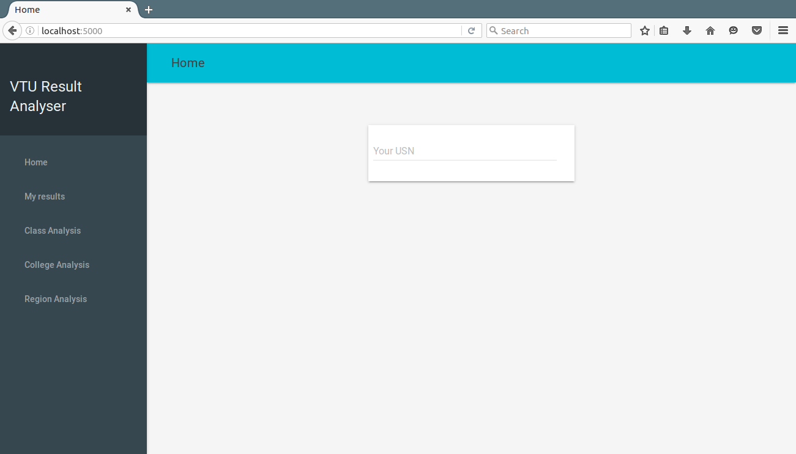
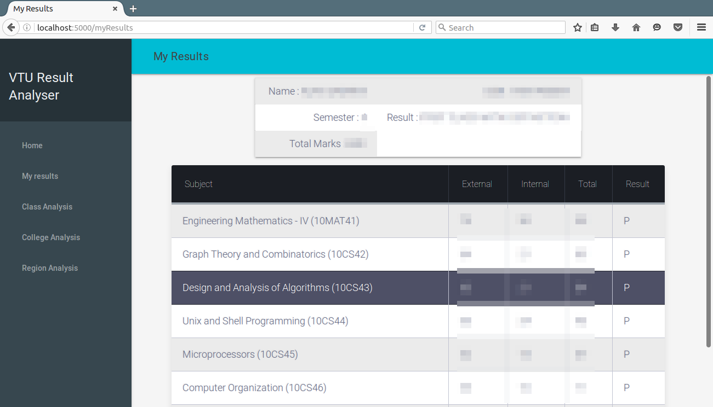
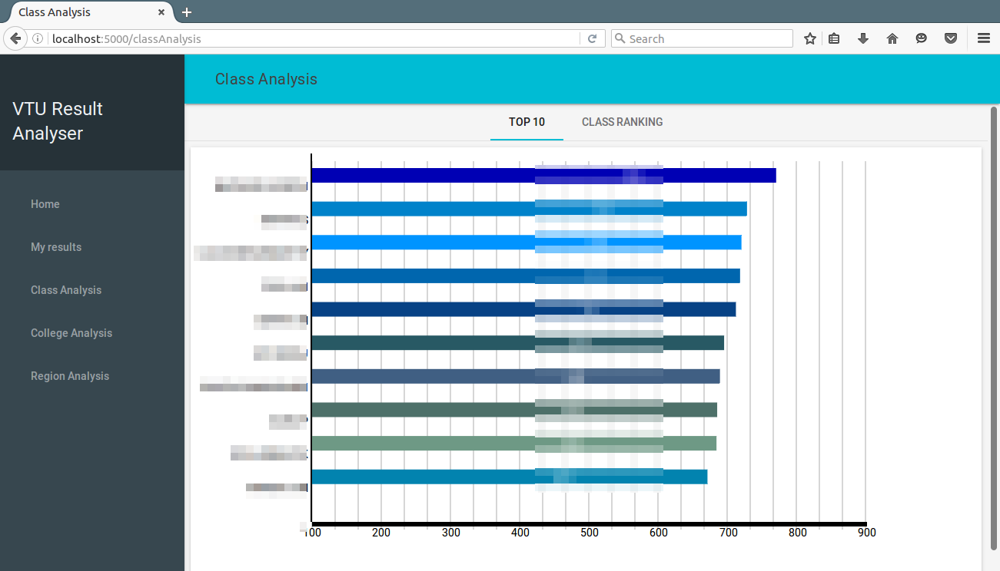
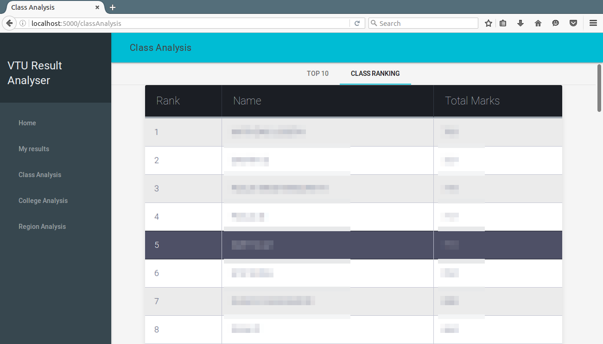

VTU Result Analyser (Deprecated)
===================

A Python Flask project to help you get rid of your frustration VTU results website when it goes down! 
Want to see your marks, your classmates' marks, and a lot more, in one single place?
Want to know who topped?
This is your answer!

----------

Installation
-------------

 - Clone the repository
 
    ` $ git clone https://github.com/abhijith0505/VTU-Result-Notifier.git`
   
 - Install the required modules using, 
 
	`$ pip install -r requirements.txt`

> If you do not have pip installed, install it using:  
	> `$ easy_install pip`

Screenshots
-------------

To Do
-------------

 1. Finish the College Analysis section
 2. Finish the Region Analysis section
 3. Pulling results of Diploma Lateral Entry Students
 4. Pulling reval and backloggers' results.
 5. 4th year marks don't appear as it has a different website structure.
 6. 2015 (New Scheme) marks and results don't appear

